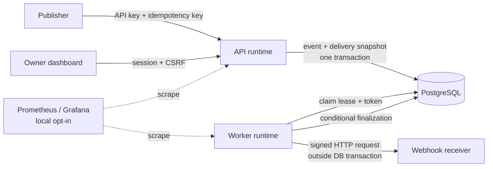

# RelayForge

RelayForge is an **outbound webhook delivery platform**. A
publisher accepts an event once, stores its routing snapshot durably in
PostgreSQL, and a separate worker delivers signed HTTP webhooks with bounded
retries and at-least-once semantics.

The project is intentionally a modular monolith—not a microservice collection.
Its focus is on transaction boundaries, concurrency, failure recovery,
operability, and explaining the trade-offs behind each choice.

## Live and local demo

- Public dashboard: [https://gialong.duckdns.org](https://gialong.duckdns.org)
- Local dashboard: `http://localhost:5173`
- Local Grafana: `http://localhost:3000/d/relayforge-performance`

For local setup and the safe demo workflow, read the
[Local Docker Demo](docs/LOCAL_DOCKER_DEMO.md). The public dashboard uses an
owner account; raw publisher API keys and webhook signing secrets are revealed
only once and must never be committed or shared.

## Architecture

One Java artifact runs in two explicit modes:

- **API** serves owner configuration, browser authentication, and publisher
  event acceptance.
- **Worker** claims due deliveries, persists attempt state, dispatches HTTP,
  and finalizes outcomes.

They share PostgreSQL as the source of truth but do not call each other.

## What RelayForge demonstrates

- PostgreSQL transactions, `FOR UPDATE SKIP LOCKED`, leases, opaque claim
  tokens, and idempotent event acceptance.
- A strict **no database transaction during outbound HTTP** boundary.
- Bounded five-attempt retry with equal jitter, durable `UNKNOWN` recovery, and
  explicit at-least-once duplicate risk.
- Spring Security browser sessions, CSRF, project-scoped publisher API keys,
  one-time secrets, outbound HMAC signing, and SSRF-resistant destination
  validation.
- Selective use of Hibernate/JPA for configuration aggregates and explicit JDBC
  for PostgreSQL-centric queue/history operations.
- Docker Compose, React/Vite dashboard, Prometheus/Grafana, JFR, structured
  logs, GitHub Actions, immutable Docker Hub tags, Caddy TLS, and EC2 Compose
  deployment.

## Measured evidence

All figures below are controlled local evidence, not a production SLA or EC2
capacity claim.

| Exercise | Result |
| --- | --- |
| Bounded publisher baseline | 1,275 accepted publishes; 0% HTTP errors; publish p50/p95 10.71/16.49 ms |
| Worker drain | 1,275 succeeded delivery attempts; final ready backlog 0; 8 free permits |
| Failure recovery | HTTP 500 and timeout retry correctly; killed worker records `UNKNOWN` then retries |
| Bounded attempts | Five retryable failures lead to `EXHAUSTED`; no sixth automatic attempt |
| Restore drill | Local custom PostgreSQL archive restored into an isolated container; immutable prior backend image reached readiness |

Detailed methodology and limitations:

- [Performance Baseline](docs/PERFORMANCE_BASELINE.md)
- [Failure and Recovery Evidence](docs/RESILIENCE_EVIDENCE.md)

## Technical decisions worth discussing

| Decision | Why |
| --- | --- |
| Modular monolith with API/worker modes | Isolates process failures while avoiding premature distributed-system contracts. |
| PostgreSQL-backed jobs | Event, delivery, attempt, and idempotency state commit atomically in one source of truth. |
| At-least-once delivery | An outbound HTTP result can be ambiguous; retry is safer than silently dropping accepted work. |
| Claim token + lease | Prevents a stale worker from overwriting current database state; it does not promise exactly-once HTTP. |
| No transaction during HTTP | Avoids holding locks and JDBC connections while a remote receiver is slow or unavailable. |
| Immutable Git-SHA images | Connects a deployed container to a precise source revision and makes rollback selection explicit. |

## Boundaries and honest limitations

RelayForge is a learning deployment, not a highly available SaaS platform:

- one temporary EC2 host and one PostgreSQL volume are a single failure domain;
- Prometheus/Grafana and load tests are local-only, not publicly exposed;
- there is no Kafka, Redis, Kubernetes, managed database, multi-region setup,
  strict ordering, or exactly-once guarantee;
- image rollback is not automatic database rollback; Flyway compatibility must
  be checked first.

These constraints are deliberate. They keep the project focused on the
reliability problem it can explain and test well.

## Documentation map

- [Architecture boundaries](docs/ARCHITECTURE_BOUNDARIES.md)
- [Delivery model](docs/DELIVERY_MODEL.md)
- [Security baseline](docs/SECURITY_BASELINE.md)
- [Local Docker demo](docs/LOCAL_DOCKER_DEMO.md)
- [Operations runbook](docs/OPERATIONS_RUNBOOK.md)
- [Performance runbook](docs/PERFORMANCE_RUNBOOK.md)
- [Recovery drill runbook](docs/RECOVERY_DRILL_RUNBOOK.md)
- [Portfolio, CV, interview, and demo guide](docs/PORTFOLIO_PLAYBOOK.md)

## Stack

Java 25, Spring Boot, Spring Security, Spring JDBC/Hikari, Hibernate/JPA,
Flyway, PostgreSQL 17, Testcontainers, React/Vite/TypeScript, Docker Compose,
Prometheus, Grafana, k6, JFR, GitHub Actions, Docker Hub, Caddy, and EC2.
