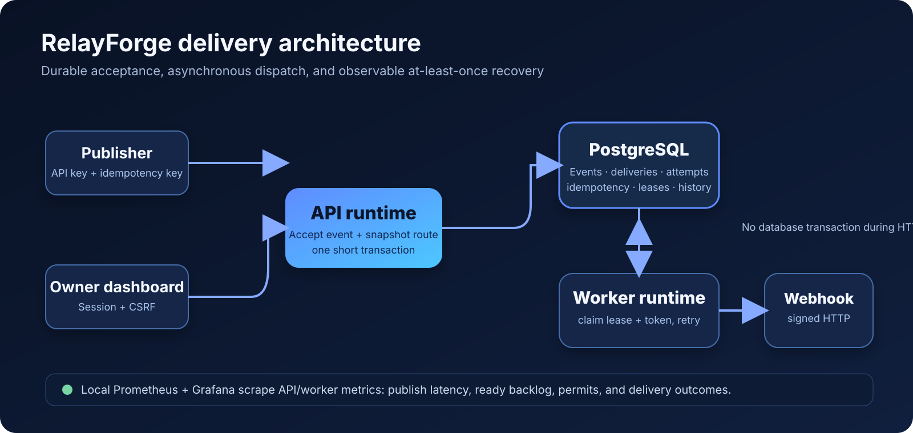
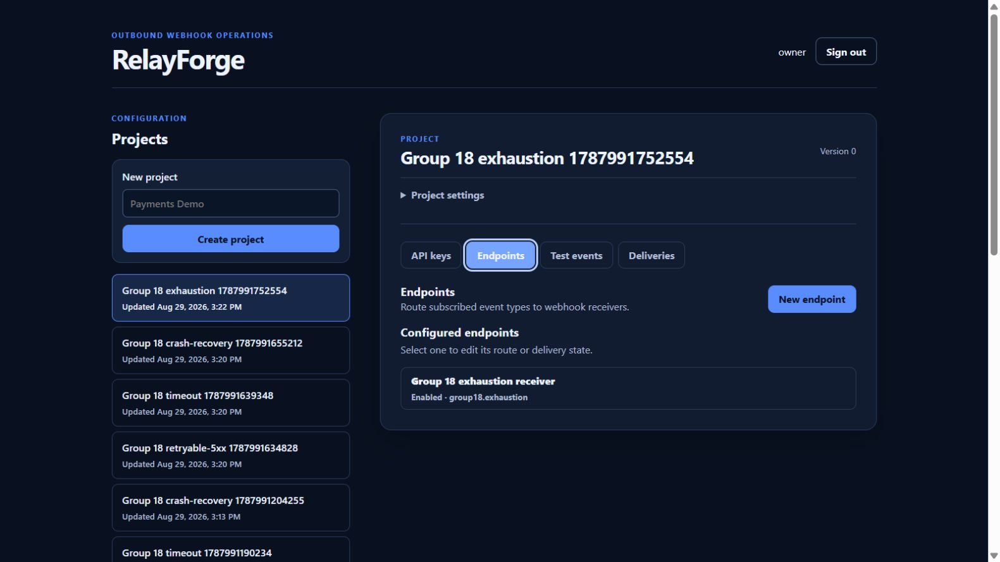
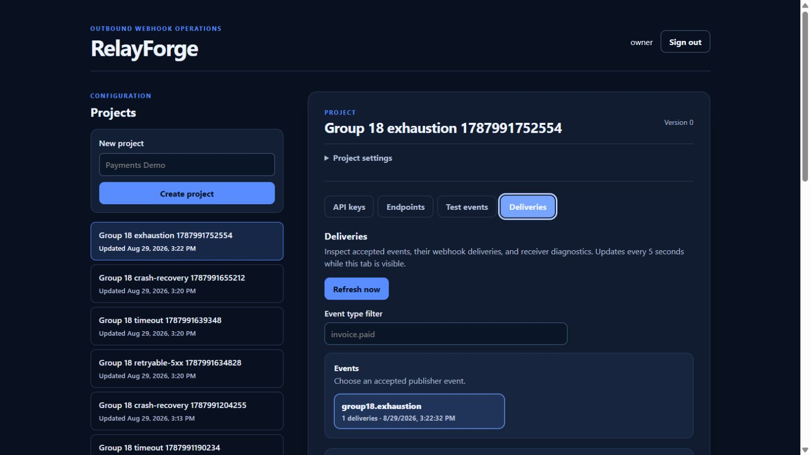

# RelayForge

**A Java outbound webhook delivery platform focused on durable async processing,
failure recovery, and the trade-offs behind at-least-once delivery.**

[Live demo](https://gialong.duckdns.org) · [Architecture](docs/ARCHITECTURE_BOUNDARIES.md) · [Performance evidence](docs/PERFORMANCE_BASELINE.md) · [Interview playbook](docs/PORTFOLIO_PLAYBOOK.md)

## Try the demo

| URL | Shared demo account |
| --- | --- |
| [gialong.duckdns.org](https://gialong.duckdns.org) | `owner` / `123456` |

This is an intentionally shared demo owner. It has normal owner permissions,
so use only non-sensitive data and do not enter real webhook credentials.

## Architecture

## What is worth looking at

- **Reliable queue semantics:** PostgreSQL stores event, routing snapshot,
  delivery, attempt, and idempotency state atomically.
- **Safe concurrent workers:** `FOR UPDATE SKIP LOCKED`, a lease, and a claim
  token prevent stale workers from overwriting current state.
- **Honest delivery model:** signed outbound HTTP runs outside database
  transactions; failures retry up to five times with at-least-once semantics.
- **Operable deployment:** Docker Compose on EC2, Caddy TLS, immutable Docker
  image tags, GitHub Actions, local Prometheus/Grafana, k6, and JFR evidence.

## Product walkthrough

  
  

The dashboard configures projects and publisher keys, then exposes accepted
events, delivery attempts, retry outcomes, and safe receiver diagnostics.
Raw API keys and endpoint signing secrets appear only once at creation.

## Evidence, not claims

| Exercise | Recorded result |
| --- | --- |
| Local k6 baseline | 1,275 publishes accepted, 0% HTTP errors, publish p95 16.49 ms |
| Worker drain | 1,275 successful attempts; ready backlog returned to 0 |
| Failure drill | 500, timeout, worker crash/`UNKNOWN`, and five-attempt exhaustion verified |
| Recovery drill | PostgreSQL archive restored privately; immutable backend image reached readiness |

These are controlled local results, not a production SLA or capacity claim.

## Learn more

- [Local Docker demo](docs/LOCAL_DOCKER_DEMO.md)
- [Failure and recovery evidence](docs/RESILIENCE_EVIDENCE.md)
- [Operations runbook](docs/OPERATIONS_RUNBOOK.md)
- [Portfolio, CV, interview, and demo playbook](docs/PORTFOLIO_PLAYBOOK.md)

## Boundaries

RelayForge is intentionally a modular monolith on one EC2 host. It does not
claim high availability, exactly-once HTTP, public metrics, or a managed
database. Those limits are deliberate so the implemented reliability behavior
remains understandable and testable.
