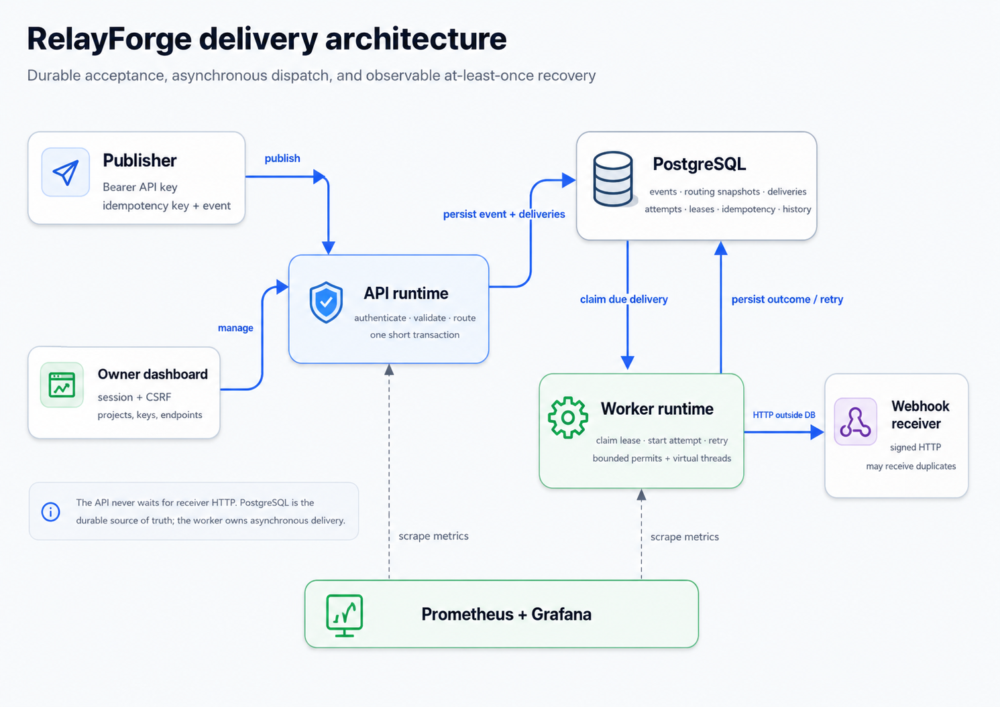
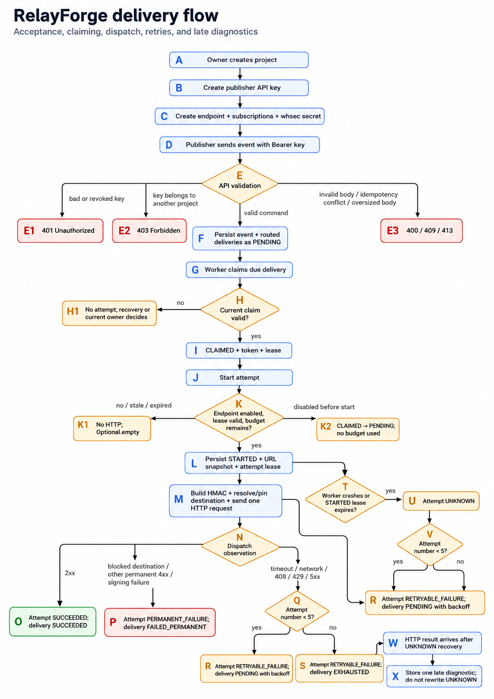

# RelayForge

**Reliable outbound webhook delivery for Java / Spring Boot.** RelayForge
durably accepts events, dispatches them asynchronously, and makes the
at-least-once failure trade-offs visible through delivery history.

[Live demo](https://gialong.duckdns.org) · [Architecture](docs/ARCHITECTURE_BOUNDARIES.md) · [Run locally](docs/LOCAL_DOCKER_DEMO.md) · [CI workflow](https://github.com/GiaLongDangPham/relayforge/actions/workflows/ci.yml) · [Interview playbook](docs/PORTFOLIO_PLAYBOOK.md)

`Java 25` · `Spring Boot` · `PostgreSQL` · `React` · `Docker Compose` · `GitHub Actions` · `EC2` · `Prometheus/Grafana`

## Start with the live demo

| URL | Shared owner account |
| --- | --- |
| [gialong.duckdns.org](https://gialong.duckdns.org) | `owner` / `123456` |

This is an intentionally shared owner account with normal owner permissions.
Use only non-sensitive data; the dashboard contents may change as other
reviewers explore it.

### Explore these scenarios

| Project | What it demonstrates |
| --- | --- |
| `Checkout Success` | One event fans out to two successful deliveries; repeating the same publish request is idempotent. |
| `No Matching Route` | A valid event remains queryable even when it creates zero deliveries. |
| `Permanent Rejection` | HTTP 400 becomes terminal after one attempt rather than consuming the retry budget. |
| `Retry and Recovery` | Retryable HTTP 500 outcomes, five-attempt exhaustion, and owner replay. |
| `Endpoint Pause and Resume` | Disabling an endpoint pauses pending work without deleting its delivery history. |

## Engineering focus

- **Durable acceptance:** PostgreSQL stores the event, routing snapshot,
  delivery intents, and idempotency record in one transaction.
- **Safe multi-worker processing:** `FOR UPDATE SKIP LOCKED`, a lease, and a
  claim token prevent a stale worker from overwriting current delivery state.
- **Honest failure model:** outbound signed HTTP runs outside database
  transactions. Retry, `UNKNOWN`, and exhaustion acknowledge that remote HTTP
  results can be ambiguous.
- **Operable delivery:** the same image runs in API or worker mode; Docker
  Compose, Caddy TLS, immutable tags, GitHub Actions, local metrics, k6, and
  JFR support the demo and operational evidence.

## Product walkthrough

<p align="center">
  
  
</p>

The dashboard configures projects, publisher keys, and endpoints, then exposes
accepted events, delivery attempts, retry outcomes, replay, and bounded safe
receiver diagnostics. Raw API keys and endpoint signing secrets appear only
once at creation.

## Architecture at a glance



The API acknowledges durable work without waiting on receivers. PostgreSQL is
the source of truth; a separate worker claims, dispatches, and conditionally
finalizes every attempt.

<details>
<summary><strong>Deep dive: delivery decision tree</strong></summary>

<br />



</details>

## Evidence, not claims

| Exercise | Recorded result |
| --- | --- |
| Local k6 baseline | 1,275 publishes accepted, 0% HTTP errors, publish p95 16.49 ms |
| Worker drain | 1,275 successful attempts; ready backlog returned to 0 |
| Failure drill | HTTP 500, timeout, worker crash/`UNKNOWN`, and five-attempt exhaustion verified |
| Recovery drill | PostgreSQL archive restored privately; immutable backend image reached readiness |

These are controlled local results, not a production SLA or capacity claim.

## Run locally

Prerequisite: Docker Desktop with Linux containers. From the repository root
in PowerShell:

```powershell
Copy-Item .env.example .env
# Replace every replace-with-... value in .env.
docker compose up --build -d
```

Open `http://localhost:5173`. The complete setup, generated encryption key,
smoke flow, and observability profile are documented in the
[Local Docker demo](docs/LOCAL_DOCKER_DEMO.md).

## Learn more

- [Failure and recovery evidence](docs/RESILIENCE_EVIDENCE.md)
- [Operations runbook](docs/OPERATIONS_RUNBOOK.md)
- [Performance baseline](docs/PERFORMANCE_BASELINE.md)
- [Portfolio, CV, interview, and demo playbook](docs/PORTFOLIO_PLAYBOOK.md)

## Boundaries

RelayForge is intentionally a modular monolith on one EC2 host. It does not
claim high availability, exactly-once HTTP, public metrics, or a managed
database. Those limits are deliberate so the implemented reliability behavior
remains understandable and testable.
