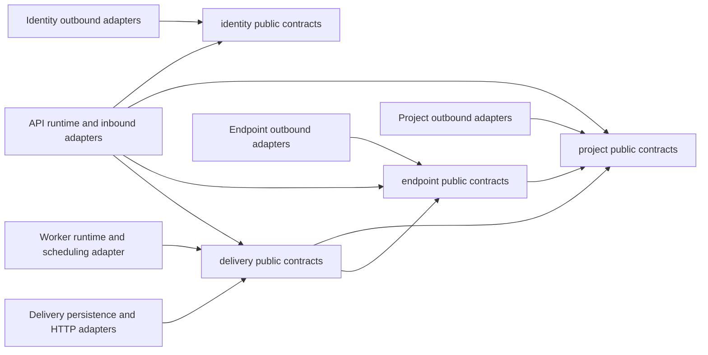

# RelayForge Architecture Boundaries

Status: Reviewed Phase 0 baseline
Last updated: 2026-08-09

## 1. Purpose and boundary

This document defines the logical boundaries of the RelayForge modular monolith:

- business-capability modules and their responsibilities;
- allowed compile-time and runtime dependencies;
- API and worker process composition;
- ownership of orchestration and transaction boundaries;
- evidence future architecture tests must provide.

It deliberately does not define database tables, JPA entities, repository queries, HTTP API contracts, package-private implementation details, or exact Spring annotations.

## 2. Architecture style

RelayForge is one modular monolith delivered as one backend artifact and one container image. The image runs in exactly one explicit mode:

- `api`: serves owner and publisher requests;
- `worker`: claims, dispatches, finalizes, and recovers deliveries.

API and worker are separate operating-system processes but not separate services. They share the same codebase, module contracts, PostgreSQL database, release version, and deployment image. They do not call each other over HTTP and do not require a message broker; PostgreSQL is their coordination boundary.

The top-level code organization follows business capabilities. Terms such as controller, service, repository, DTO, and mapper describe implementation roles inside a capability; they do not become global top-level folders.

## 3. Business modules

### 3.1 `identity`

Owns owner identity and dashboard authentication behavior:

- bootstrap owner credentials;
- password verification and password-hash lifecycle;
- owner sign-in and sign-out semantics;
- the authenticated owner identity exposed to inbound security adapters.

It does not own projects, API keys, endpoints, events, deliveries, or Spring Security configuration. Spring Security is an adapter that calls `identity` contracts and translates the result into an authenticated request context.

### 3.2 `project`

Owns the project access boundary:

- project identity, name, and single-owner relationship;
- create, view, and rename project use cases;
- publisher API-key generation, hashing, identification, verification, and revocation;
- public authorization contracts for checking whether an owner may act on a project;
- the authenticated project identity produced from a publisher API key.

It treats an owner identifier as an opaque identity supplied by the authenticated request context. It does not load identity credentials or depend on `identity` internals.

### 3.3 `endpoint`

Owns outbound destination configuration:

- endpoint identity, name, URL, enabled state, and exact event-type subscriptions;
- endpoint signing-secret generation and protected retrieval for dispatch;
- enable, disable, and configuration-change rules;
- routing snapshots of enabled endpoint identities for an event type;
- batch claim-eligibility checks that determine which candidate endpoint identities are still enabled;
- attempt-start snapshots containing the current enabled state, URL, and signing material required by the delivery workflow.

It depends on the public project-access contract to enforce ownership. It does not know about event, delivery, attempt, replay, claim, or retry state.

### 3.4 `delivery`

Owns the core reliable-delivery capability:

- publish idempotency and immutable accepted events;
- atomic creation of the complete delivery set from a routing snapshot;
- delivery and attempt state machines;
- claim tokens, leases, due-time scheduling, retry decisions, and recovery;
- replay idempotency and linked replay deliveries;
- event, delivery, attempt, and diagnostic history queries;
- worker orchestration around claim, attempt start, dispatch, finalization, and recovery;
- retention rules for terminal delivery history.

It depends only on public contracts from `project` and `endpoint`, plus outbound technical ports that it owns. It never imports another module's persistence model or repository.

## 4. Why event acceptance and delivery processing stay together

`event`, `publish`, `job`, `delivery`, and `attempt` are not separate top-level modules in Portfolio v1. They are concepts inside the `delivery` capability.

The deciding invariant is atomic event acceptance: one publish transaction must persist the immutable event and the complete selected delivery set. Separating these concepts would either expose repositories across modules, introduce a dependency cycle, or require an asynchronous consistency mechanism that does not solve a current problem.

Keeping them together makes that invariant local and allows PostgreSQL to enforce it in one transaction. The trade-off is a larger core module, so its internal packages must still separate publish, processing, replay, and history behaviors without pretending they are independently deployable services.

## 5. Dependency rules

The arrows mean “may depend on the target's public contract,” not “may access all target packages.”

The following rules are mandatory:

1. Business-module dependencies are acyclic: `identity` and `project` depend on no other business module; `endpoint` may depend on `project`; `delivery` may depend on `project` and `endpoint`.
2. Runtime composition and inbound adapters may call module public contracts but contain no business rules.
3. A module may expose commands, queries, results, identifiers, and narrow ports. It must not expose JPA entities, repositories, or mutable domain objects.
4. A module must not import another module's internal application, domain, or persistence packages.
5. Cross-module work uses synchronous in-process contracts for Portfolio v1. No in-process asynchronous event bus, Kafka, or outbox is used for correctness-critical state changes.
6. Each module owns its persistence access. Cross-module reads and writes go through public contracts, never through another module's repository.
7. There is no generic `common`, `shared`, or `util` business module at the start. A shared abstraction is extracted only after multiple concrete uses prove the same semantic concept.
8. Framework types such as HTTP requests, Spring Security principals, and JPA entities do not enter domain rules. Inbound adapters translate them into module-owned command and identity types.

## 6. Runtime boundaries

### 6.1 API mode

API mode activates:

- owner authentication and dashboard HTTP adapters;
- publisher API-key authentication and publish HTTP adapter;
- project, endpoint, event, delivery, attempt, and replay use cases required by requests;
- API health and observability adapters.

It does not start delivery polling, lease recovery, or outbound webhook dispatch loops.

### 6.2 Worker mode

Worker mode activates:

- due-delivery polling and claiming;
- attempt-start orchestration;
- destination validation, request signing, and outbound HTTP;
- conditional attempt finalization;
- expired-lease recovery;
- worker health and observability adapters.

It does not expose owner or publisher business endpoints. A dedicated management endpoint may later expose only health and metrics.

### 6.3 Mode selection

One explicit property such as `relayforge.runtime=api|worker` selects the mode. Environment profiles remain for environment-specific configuration and are not used to blur runtime responsibility. Startup must fail for a missing, invalid, or ambiguous mode outside focused tests.

Both modes use the same artifact and image. Docker Compose or the cloud runtime starts that image twice with different mode values. This gives process-level failure isolation and independent instance counts while retaining one deployable codebase.

## 7. Orchestration and transaction ownership

Transaction boundaries belong to module application use cases, not controllers, schedulers, domain objects, or HTTP clients.

| Workflow | Orchestration owner | Transaction boundary |
| --- | --- | --- |
| Owner sign-in or credential maintenance | `identity` | One short identity-owned transaction when persistence changes. |
| Project or API-key mutation | `project` | One short project-owned transaction. Raw generated API-key material exists only at the creation boundary. |
| Endpoint mutation | `endpoint` | One short endpoint-owned transaction after project authorization. |
| Publish event | `delivery` | One transaction covers idempotency resolution, immutable event persistence, endpoint routing-snapshot read, and creation of the complete delivery set. |
| Claim due deliveries | `delivery` | One short transaction locks candidate delivery rows, checks endpoint enabled state in one batch through the endpoint public contract, and changes only eligible rows to `CLAIMED`; it commits before outbound work. |
| Start attempt | `delivery` | One short transaction validates claim/lease/budget, reads the endpoint attempt snapshot through its public contract, creates `STARTED`, and extends the lease once. |
| Validate destination and send HTTP | `delivery` worker orchestration through outbound ports | No database transaction is open. |
| Finalize attempt | `delivery` | One short conditional transaction atomically finalizes attempt and delivery state and invalidates token/lease. |
| Recover expired claim | `delivery` | One short conditional transaction uses PostgreSQL time and the expired current token. |
| Replay exhausted delivery | `delivery` | One transaction resolves replay idempotency and creates one linked delivery with a fresh budget. |
| Inspect owner delivery history | `delivery` | One short read-only transaction verifies project ownership, reads delivery history, and obtains only safe current endpoint metadata through its public query contract. |
| Compose dashboard read response | API adapter using module query contracts | No cross-module mutation transaction; the adapter may compose immutable query results. |

Four cross-module read capabilities are deliberately allowed inside `delivery` transactions:

1. publish reads an `endpoint` routing snapshot;
2. claim reads an enabled-endpoint snapshot to exclude paused backlog, then rechecks and row-locks its selected candidate endpoints in one batch;
3. attempt start reads an `endpoint` configuration snapshot.
4. history inspection reads only current endpoint identity, name, and enabled state to derive owner-visible delivery status; it never reads a URL or signing material.

Those endpoint contracts must join the caller's existing local transaction, perform database work only, and never open `REQUIRES_NEW` transactions or make network calls. The first claim snapshot is a fairness aid, not the correctness boundary: candidate delivery SQL excludes disabled endpoints so paused rows cannot occupy claim capacity. The final endpoint recheck row-locks only candidate endpoints. A candidate becomes `CLAIMED` only after that recheck says its endpoint is enabled; a concurrent disable either commits first and excludes it, or waits until claim commit.

Group 6 uses `READ COMMITTED`, `FOR UPDATE SKIP LOCKED` for bounded due delivery candidates, a final endpoint `FOR UPDATE` recheck, and partial pending/claimed claim indexes. Group 7 uses a `READ COMMITTED` transaction that row-locks the current claimed delivery, row-locks the endpoint configuration through its public snapshot contract, conditionally verifies that no `STARTED` attempt exists at the mutation boundary, writes `STARTED`, and extends the lease. V9 independently enforces one `STARTED` attempt per delivery. The snapshot carries URL plus opaque encrypted signing material; only the later outbound adapter may request its transient plaintext. Finalization and post-attempt recovery SQL remain deferred. No delivery code imports an endpoint repository.

## 8. Ports and adapters inside a module

Each module may use ports and adapters where they clarify a real boundary:

- inbound ports represent business use cases invoked by REST or scheduling adapters;
- application orchestration owns authorization calls and transaction boundaries;
- domain code owns state transitions and pure business rules;
- outbound ports represent persistence, password hashing, secret generation, database time, destination validation, and HTTP dispatch as required by that module;
- adapters implement those ports with Spring, PostgreSQL, cryptography, or an HTTP client.

These are responsibilities, not a requirement to create the same folder tree for every feature. Small behavior may remain together until separation improves comprehension or testing.

The outbound webhook sender implements a `delivery`-owned port. It may receive an immutable dispatch instruction containing only the data required for one attempt. It cannot claim work, update delivery state, or access repositories.

## 9. Data ownership without schema design

| Module | Concepts it owns | Concepts it may reference by stable identity |
| --- | --- | --- |
| `identity` | Owner credentials and authentication lifecycle | None initially. |
| `project` | Project ownership and publisher API-key lifecycle | Owner identifier. |
| `endpoint` | Endpoint configuration, subscriptions, enabled state, signing material | Project identifier. |
| `delivery` | Publish idempotency, events, deliveries, attempts, late diagnostics, replay idempotency | Project and endpoint identifiers. |

Reference by identity does not grant repository access. Database foreign keys and schemas will be chosen later; logical ownership remains with the module named above.

## 10. Boundary enforcement and future test evidence

Because all modules share one process and database, their boundaries must be executable rather than purely conventional. When the module skeleton is introduced, architecture tests will enforce package dependencies with ArchUnit; exact dependency coordinates are chosen in that implementation slice.

The architecture baseline is not considered implemented until tests demonstrate:

1. business-module dependencies match the allowed acyclic graph;
2. no module imports another module's internal or persistence packages;
3. module public contracts expose no repository or JPA entity;
4. API mode does not create worker polling, recovery, or outbound-dispatch components;
5. worker mode does not expose owner or publisher business controllers;
6. missing or invalid runtime mode fails startup;
7. a fault during publish rolls back the event and its complete delivery set together;
8. disabled endpoints are not changed to `CLAIMED`, a concurrent disable cannot pass between eligibility check and claim commit, and paused backlog does not starve enabled due work;
9. outbound HTTP occurs after claim and attempt-start transactions commit;
10. an outbound sender cannot mutate delivery persistence directly;
11. representative owner and publisher flows cannot cross project boundaries through module contracts.

## 11. Consequences and evolution triggers

### Benefits

- Atomic correctness-critical workflows remain local database transactions.
- API downtime does not stop an already-running worker; worker downtime allows the API to accept durable backlog.
- Worker instances can scale independently while the lease protocol coordinates them.
- There is one build, one version, and no internal network contract to operate.
- Capability boundaries remain visible enough to support focused tests and later extraction if evidence demands it.

### Costs

- API and worker share a release cadence and can share code defects.
- A shared database is a common availability dependency.
- Logical boundaries can erode unless architecture tests reject forbidden imports.
- Synchronous module calls couple their availability and transaction behavior inside one process.

### Evidence required before extraction

A module is not turned into a microservice merely because it has a clean boundary. Extraction requires measured or organizational evidence such as an incompatible scaling profile, an independent release requirement, a distinct ownership team, or unacceptable failure coupling that process separation cannot solve.

A message broker is reconsidered only if PostgreSQL job polling creates a measured throughput, contention, or operational limitation. Kubernetes is reconsidered only if the chosen cloud runtime can no longer meet demonstrated deployment or scaling needs.

## 12. Decisions deferred to focused slices

- Exact Java base package and internal package layout.
- Concrete module public interfaces and command/result types.
- Spring conditional-configuration mechanism for runtime modes.
- Owner authentication/session implementation following `SECURITY_BASELINE.md`.
- Physical schema, foreign keys, transaction isolation, locks, and migration ownership following both database-model documents.
- OpenAPI/DTO/controller implementation following `API_CONTRACT.md`.
- Exact ArchUnit version and boundary rules expressed as code.
- Observability, retention scheduling, and deployment configuration.

All later decisions must preserve the dependency graph, module ownership, and transaction rules in this document unless an ADR explicitly supersedes them.
