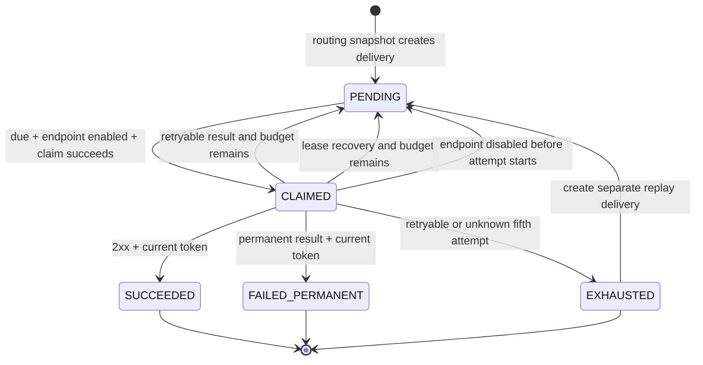

# RelayForge Delivery Model

Status: Reviewed Phase 0 baseline
Last updated: 2026-08-09

## 1. Purpose and boundary

This document defines the correctness model for RelayForge delivery processing:

- business invariants;
- delivery and attempt states;
- lease and claim-token lifecycle;
- transaction boundaries;
- failure scenarios and recovery behavior;
- the evidence future tests must provide.

It deliberately does not define database tables, JPA entities, repository queries, HTTP API contracts, indexes, or framework annotations.

## 2. Core correctness statement

Once RelayForge acknowledges an event as accepted, the event and its routing snapshot are durable. Every created delivery remains eligible for processing until it reaches a terminal state or is effectively paused by a disabled endpoint.

RelayForge provides at-least-once delivery. It prevents a stale worker from corrupting current database state, but it cannot retract an outbound HTTP request or prove whether a receiver committed its own business transaction. Therefore duplicate and even concurrently overlapping HTTP delivery are valid failure-recovery outcomes.

## 3. Business invariants

### INV-01 - Atomic event acceptance

Accepting a new publish command persists the immutable event and the complete delivery set selected by its routing snapshot as one atomic business operation.

There must not be an acknowledged event with only part of its expected delivery set.

### INV-02 - Publish idempotency

Within one project, an idempotency key identifies one logical publish command.

- Same key and equivalent command returns the original event and creates nothing new.
- Same key with different event content is a conflict.
- Concurrent requests using the same key converge on one event and one delivery set.

### INV-03 - Immutable event

An accepted event's project, event type, payload, and identifier do not change. Correction is represented by publishing another event rather than mutating history.

### INV-04 - Routing snapshot stability

Event acceptance selects endpoint identities subscribed to the exact event type at that moment. Later subscription changes do not add or remove deliveries for the accepted event.

The selected endpoint identity is stable. Its destination URL is resolved from current endpoint configuration when an attempt starts.

### INV-05 - Delivery terminality

`SUCCEEDED`, `FAILED_PERMANENT`, and `EXHAUSTED` are terminal for one delivery. Automatic processing never moves a terminal delivery back to a nonterminal state.

Manual replay creates a new linked delivery and leaves the original unchanged.

### INV-06 - Bounded attempts

A delivery starts at most five attempts. Attempt numbers are monotonic within a delivery and are never reused.

The attempt budget is consumed when a dispatch cycle is durably marked `STARTED` immediately before destination resolution, security validation, and possible network I/O. A crash after this boundary still consumes the attempt because RelayForge cannot prove how far the dispatch cycle progressed.

### INV-07 - Append-only attempt history

Each started dispatch cycle has one attempt record. Its status moves from `STARTED` to exactly one terminal observation: success, retryable failure, permanent failure, or unknown outcome. A terminal attempt status is immutable and historical attempts are never removed during the delivery lifecycle.

If a stale worker reports an observed result after recovery already finalized its attempt as `UNKNOWN`, RelayForge stores a separate late diagnostic linked to that attempt. It never rewrites `UNKNOWN` and never applies the late result to delivery state.

### INV-08 - One current claim token

A nonterminal delivery has at most one current claim token in RelayForge state. Each successful claim creates a new, globally unique opaque token and a finite lease.

Only a worker presenting the current token while its lease is unexpired may apply a normal delivery state transition. Every transition out of `CLAIMED` atomically clears the token and lease. A stale worker may record a separate late diagnostic result for its own attempt, but that result cannot change the delivery selected by recovery or a newer claim.

### INV-09 - No database transaction during HTTP

RelayForge commits claim and attempt-start state before outbound HTTP begins. It never keeps the claim transaction, row lock, or database connection open while waiting for a receiver.

Attempt finalization and the resulting delivery transition form a separate atomic database operation.

### INV-10 - Disabled endpoint pauses new work

A disabled endpoint is excluded from new routing and from eligibility for new attempts on existing nonterminal deliveries.

An attempt whose network operation already started may finish. If disablement is observed after claim but before the attempt-start boundary, the worker releases the claim without consuming an attempt.

### INV-11 - At-least-once side effects

RelayForge does not use database state to claim exactly-once receiver behavior. If an outcome is ambiguous, retry is allowed and the receiver is expected to deduplicate using stable event or delivery identity.

### INV-12 - Database time is authoritative

Due-time and lease-expiry comparisons use PostgreSQL time rather than independently sampled worker clocks. This avoids correctness depending on clock agreement between worker processes.

## 4. Delivery state model

### 4.1 Persisted states

| State | Meaning | Terminal |
| --- | --- | --- |
| `PENDING` | Waiting for its first attempt or a scheduled retry. A due-time determines when it may be claimed. | No |
| `CLAIMED` | Owned temporarily by one claim token until completion, release, or lease expiry. | No |
| `SUCCEEDED` | The current claim recorded an HTTP 2xx result. | Yes |
| `FAILED_PERMANENT` | The current claim recorded a non-retryable result, including HTTP 4xx other than 408/429 or a blocked destination. | Yes |
| `EXHAUSTED` | The fifth started attempt ended retryably or ambiguously; no automatic attempt remains. | Yes |

`RETRY_SCHEDULED` is a product-facing label, not a separate required persisted state. It is represented by `PENDING` with at least one prior attempt and a future due-time.

`PAUSED` is also an effective label rather than a required persisted delivery state. A nonterminal delivery is effectively paused when its endpoint is disabled, because it fails the eligibility predicate.

### 4.2 State transitions

The last arrow represents creation of a new linked delivery, not mutation of the exhausted delivery.

### 4.3 Eligibility predicate

A delivery may be claimed only when all conditions are true:

1. its persisted state is `PENDING`;
2. its due-time is not later than current PostgreSQL time;
3. its attempt budget is not exhausted;
4. its endpoint is enabled;
5. its project is owned and otherwise valid for Portfolio v1 processing.

Exact SQL and indexes are deferred to the database-design slice.

## 5. Attempt lifecycle

### 5.1 Attempt states

| State | Meaning |
| --- | --- |
| `STARTED` | The worker durably crossed the dispatch boundary and is about to validate the snapshotted destination and possibly perform network I/O. |
| `SUCCEEDED` | The worker observed HTTP 2xx. |
| `RETRYABLE_FAILURE` | The worker observed timeout, network failure, HTTP 408, 429, or 5xx. |
| `PERMANENT_FAILURE` | The worker observed a non-retryable 4xx or the dispatch cycle rejected the destination before sending. |
| `UNKNOWN` | The attempt started, but RelayForge could not durably determine or apply its result before lease recovery. |

`STARTED` means RelayForge began a dispatch cycle. It does not prove that network I/O occurred, that the receiver accepted bytes, or that the receiver processed the event.

### 5.2 Attempt outcome versus delivery outcome

- A successful attempt makes the delivery `SUCCEEDED`.
- A permanent failed attempt makes the delivery `FAILED_PERMANENT`.
- A retryable failed attempt returns the delivery to `PENDING` with a later due-time when fewer than five attempts have started.
- A retryable or unknown fifth attempt makes the delivery `EXHAUSTED`.
- An unknown earlier attempt returns the delivery to `PENDING` using retry backoff because duplicate delivery is safer than silently losing accepted work.
- A late result submitted after the attempt already became `UNKNOWN` is stored as a separate diagnostic observation. It does not rewrite the attempt or apply to the delivery.

## 6. Claim, send, and completion lifecycle

### Step 1 - Claim in a short transaction

The worker first obtains a current enabled-endpoint snapshot so paused backlog is excluded from candidate selection. It then locks due `PENDING` work without waiting on rows already claimed by another worker, rechecks and row-locks the selected candidate endpoints, and for every successful claim:

1. changes the delivery from `PENDING` to `CLAIMED`;
2. generates a new claim token;
3. records a finite lease expiry based on PostgreSQL time;
4. commits immediately.

No outbound network call occurs in this transaction.

The initial endpoint snapshot only keeps paused rows from consuming a bounded claim batch. The final row-locked recheck is the correctness boundary: a concurrent disable either becomes visible before recheck and leaves the delivery `PENDING`, or waits until the claim commits.

### Step 2 - Revalidate before starting an attempt

After claim commit, the worker may perform an advisory preflight check of current endpoint configuration:

- the endpoint appears enabled;
- the URL has a supported form;
- an attempt appears to remain in the budget.

This check may avoid unnecessary work but is not a correctness boundary because configuration, time, and claim ownership can change immediately afterward.

### Step 3 - Cross the attempt boundary

In a new short transaction, the worker atomically requires all of the following:

1. the delivery is still `CLAIMED`;
2. the submitted claim token is current;
3. the lease is unexpired according to PostgreSQL time;
4. the endpoint is still enabled;
5. an attempt remains in the budget.

The same transaction snapshots the current endpoint URL for this attempt, creates the next monotonic attempt as `STARTED`, and extends the existing claim lease once to an attempt-execution deadline based on PostgreSQL time. This is the linearization point for endpoint configuration and the point at which the attempt budget is consumed.

If the endpoint is disabled, the worker conditionally returns the delivery to `PENDING`, clears the token and lease, and consumes no attempt. If another precondition fails, the worker does not start an attempt and leaves recovery or the current owner to determine the next state.

The attempt-execution lease must exceed the configured HTTP timeout plus a completion margin. Portfolio v1 permits this single extension at attempt start but uses no periodic lease heartbeat. Exact durations are deferred.

### Step 4 - Perform HTTP outside a transaction

The worker resolves and validates the snapshotted URL immediately before connecting, builds the signed request, starts outbound HTTP only for an allowed destination, and waits only up to the configured timeout. Redirects are disabled.

A prohibited destination finalizes the already-started dispatch cycle as `PERMANENT_FAILURE`, moves the delivery to `FAILED_PERMANENT`, and consumes that attempt. No network request is made.

The system accepts that lease expiry or database unavailability can make this outcome ambiguous.

### Step 5 - Finalize conditionally

In another short transaction, the worker records the observed attempt result and applies the corresponding delivery transition only if the delivery is still `CLAIMED`, its claim token is current, and its lease is unexpired according to PostgreSQL time.

Attempt finalization, the accepted delivery transition, and token/lease invalidation commit atomically. This applies to success, permanent failure, retry scheduling, and exhaustion. The pre-start endpoint release in Step 3 follows the same conditional token/lease invalidation rule but has no attempt to finalize. If state, token, or lease validation fails, the observed result cannot alter delivery state and may be stored only as a separate late diagnostic.

## 7. Lease recovery

A recovery worker finds `CLAIMED` deliveries whose lease expired according to PostgreSQL time. Recovery is conditional on the expired claim token still being current.

### 7.1 Claim expired before attempt start

- No attempt budget was consumed.
- Atomically clear the expired token and lease and return the delivery to `PENDING`.
- It may be claimed again immediately if its endpoint remains enabled.

### 7.2 Claim expired after attempt start

- Atomically mark the unfinished attempt `UNKNOWN`, invalidate the expired token and lease, and apply the recovery delivery transition.
- If fewer than five attempts started, return the delivery to `PENDING` with retry backoff.
- If it was the fifth attempt, move the delivery to `EXHAUSTED`.

Recovery never assumes the receiver did not process an unknown attempt.

## 8. Failure and recovery matrix

| Failure point | Observable state | Recovery | Duplicate risk |
| --- | --- | --- | --- |
| API fails before event-acceptance commit | No acknowledged event is required to exist | Publisher retries with the same idempotency key | No logical duplicate |
| API commits acceptance but response is lost | Event and complete delivery set exist | Publisher retry returns the original logical result | No logical duplicate |
| Worker crashes before claim commit | Delivery remains `PENDING` | Another worker claims it | No added risk |
| Worker crashes after claim but before attempt start | `CLAIMED`, no started attempt | Lease recovery returns it to `PENDING` without consuming budget | No HTTP duplicate from this claim |
| Worker crashes after attempt start but before validation or HTTP begins | Started dispatch cycle has unknown progress | Lease recovery records `UNKNOWN` and retries if budget remains | Possible by design, even if this instance sent no bytes |
| Receiver processes request but response is lost | Worker observes timeout/network failure | Record retryable failure and schedule another attempt | Expected at-least-once duplicate |
| Worker receives response but crashes before finalization | Attempt remains `STARTED`; delivery remains `CLAIMED` | Lease recovery records `UNKNOWN` and retries if budget remains | Expected duplicate |
| PostgreSQL unavailable before claim | No claim is committed | Stop claiming and retry database access with bounded operational backoff | None from this worker |
| PostgreSQL unavailable after HTTP | Receiver outcome cannot be applied | Retry database finalization only while claim is valid; otherwise allow lease recovery | Possible duplicate; do not resend HTTP inside the same attempt |
| Lease expires while slow HTTP is still running | Recovery invalidates the old token; a newer worker may claim later | Old worker result becomes a separate late diagnostic; `UNKNOWN` is not rewritten | Concurrent duplicate possible |
| Endpoint disabled before attempt starts | Current claim sees disabled endpoint | Release to effective paused state without consuming attempt | None |
| Endpoint disabled after HTTP starts | In-flight request continues | Record its result normally; no new attempt starts while disabled | Existing request cannot be undone |
| Worker submits result with stale token or expired lease | Conditional delivery update affects zero current claims | Store a separate late diagnostic if safe; do not rewrite an `UNKNOWN` attempt or transition delivery | Database state protected; HTTP duplicate may already exist |
| Worker receives 408, 429, 5xx, timeout, or network error | Retryable attempt | Backoff to `PENDING`, or `EXHAUSTED` on attempt five | Possible duplicate |
| Worker receives non-408/429 4xx or destination is blocked | Permanent dispatch attempt | Move to `FAILED_PERMANENT`; owner may fix the endpoint and publish a new event | No automatic retry |
| Worker shuts down gracefully | No new claims; active work has a deadline | Finish and finalize, or exit and let leases recover | Possible only for unfinished started attempts |

## 9. Concurrency consequences

### 9.1 What claim tokens guarantee

Claim tokens guarantee that only the current claim can move current delivery state. They prevent stale completion from overwriting a newer worker's decision.

### 9.2 What claim tokens do not guarantee

They do not guarantee:

- that only one HTTP request ever reaches the receiver;
- that an expired worker stops executing;
- that the receiver applies the business effect once;
- that deliveries finish in event order.

Those limitations are why the public contract is at-least-once and receivers need idempotency.

### 9.3 Why no lease heartbeat in Portfolio v1

A claim lease, one atomic extension at attempt start, and a shorter bounded HTTP timeout are simpler to reason about and test than periodic heartbeats. Heartbeats add renewal races, extra writes, and another failure path. The design should be revisited only if measured requests legitimately need to run longer than a safe bounded attempt lease.

## 10. Required future test evidence

The implementation is not considered correct until tests demonstrate:

1. concurrent publish commands with one idempotency key converge on one event and delivery set;
2. multiple workers do not hold two current claim tokens for one delivery;
3. blocked receiver I/O does not keep the claim transaction or connection open;
4. a crash before attempt start does not consume attempt budget;
5. a crash after attempt start becomes `UNKNOWN` and may produce duplicate delivery;
6. attempt start fails atomically if the lease expired or the endpoint was disabled after advisory preflight;
7. URL updates concurrent with attempt start have one deterministic result based on the attempt-start snapshot;
8. a stale token or expired lease cannot alter delivery state after recovery;
9. lease recovery makes an unfinished attempt immutably `UNKNOWN`, and a late result is stored separately;
10. the fifth retryable or unknown attempt produces `EXHAUSTED` without a sixth attempt;
11. endpoint disablement prevents new attempts while allowing an already-started attempt to finish;
12. a retry uses stable event and delivery identifiers while creating a new attempt number;
13. manual replay creates a separate linked delivery and is idempotent by replay key;
14. due-time and lease-expiry behavior use PostgreSQL time;
15. every transition out of `CLAIMED` invalidates the claim token and lease;
16. terminal deliveries never re-enter automatic processing.

## 11. Downstream decisions and remaining implementation work

Phase 0 resolved the previously deferred behavioral choices in focused documents:

- timing, retry, batch, polling, concurrency, recovery, and shutdown defaults: [Delivery Runtime Defaults](DELIVERY_RUNTIME_DEFAULTS.md);
- delivery/attempt/late-diagnostic storage concepts: [Database Model Part 2](DATABASE_MODEL_PART2.md);
- HMAC, secret handling, and destination-validation behavior: [Security Baseline](SECURITY_BASELINE.md);
- API errors, pagination, idempotency, history, and replay behavior: [API Contract](API_CONTRACT.md).

Implementation still must choose and verify concrete SQL, indexes, constraints, lock modes, isolation levels, Java adapters, and cloud configuration. Those choices must preserve the invariants and failure behavior in this document.
